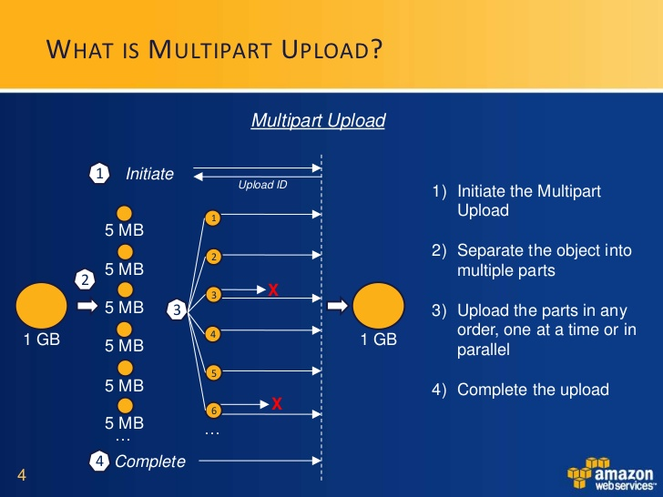
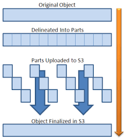
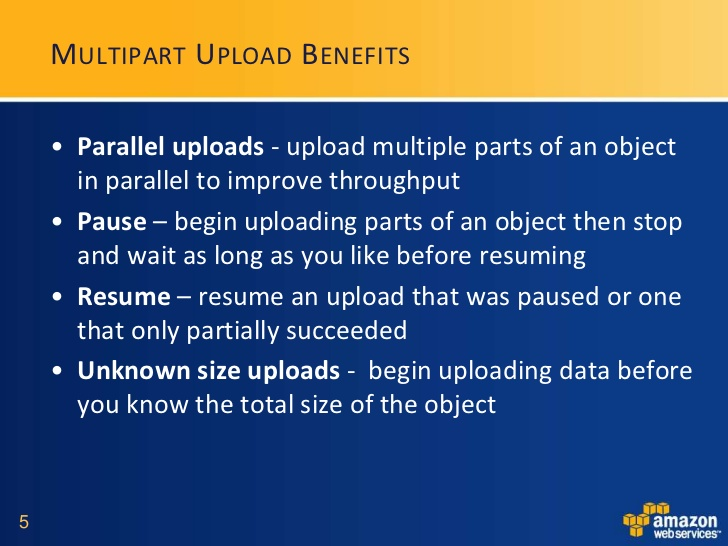

# Multipart Upload Tutorial
A tutorial for understanding or using the multipart upload feature of Amazon S3
 This tutorial was presented live at this [meetup](https://www.meetup.com/Amazon-Web-Services-Study-Group-San-Diego/): 





The original blog post from AWS can be found [here](https://aws.amazon.com/premiumsupport/knowledge-center/s3-multipart-upload-cli/):


# Summary: 
 Multipart upload is a fast way to load data into Amazon S3.  Normal put operations are only 
 
If multipart upload is too complicated, try using the S3 [sync](https://docs.aws.amazon.com/cli/latest/reference/s3/sync.html) command.  


*The concept:*




## Tutorial Steps: 


**1. Get a large file:**

```
curl -o bigpic.jpg http://www.effigis.com/wp-content/uploads/2015/02/Airbus_Pleiades_50cm_8bit_RGB_Yogyakarta.jpg
```

**2. Create a bucket:**

 - bucket name: 3456testmpb 

```
aws s3 mb s3://3456testmpb

```


**3. Calculate MD5 for later validation:**

```
md5 bigpic.jpg 

#echo the MD5 hash and base64 encode the hash
echo 06cb38d17f68a7dc5db6b2d8c4122b03 | base64

```


**4. Split large file into parts:**

 file name prefix: part- 

```
split -b 10m bigpic.jpg part-

```


**5. Create new multipart upload with S3 before uploading parts:**

 bucket name: 3456testmpb 
 object key: multipart/bigpic.jpg 

```

aws s3api create-multipart-upload --bucket 3456testmpb --key 'multipart/bigpic.jpg'

{
    "Bucket": "3456testmpb", 
    "UploadId": "22Jsr1b4jfQXMAq210Y3Jns20NO3kUWD1n41xCgyN8NFtmSfF3cByt9XxY5PNirAecjlKpPQsYZbyfOacg758NuXtfFZ5FXeoft0CE0SQiuO64r9P.Noopv5vPHP96Gu", 
    "Key": "multipart/bigpic.jpg"
}

```
*Save the UploadId for later use:*


**6. Upload each part into S3:**

 bucket name: 3456testmpb 
 UploadId: 22Jsr1b4jfQXMAq210Y3Jns20NO3kUWD1n41xCgyN8NFtmSfF3cByt9XxY5PNirAecjlKpPQsYZbyfOacg758NuXtfFZ5FXeoft0CE0SQiuO64r9P.Noopv5vPHP96Gu
 part-number: x
 body-part: part-y 


```

aws s3api upload-part --bucket 3456testmpb --key 'multipart/bigpic.jpg' --part-number 1 --body part-aa --upload-id  "22Jsr1b4jfQXMAq210Y3Jns20NO3kUWD1n41xCgyN8NFtmSfF3cByt9XxY5PNirAecjlKpPQsYZbyfOacg758NuXtfFZ5FXeoft0CE0SQiuO64r9P.Noopv5vPHP96Gu"

aws s3api upload-part --bucket 3456testmpb --key 'multipart/bigpic.jpg' --part-number 2 --body part-ab --upload-id  "22Jsr1b4jfQXMAq210Y3Jns20NO3kUWD1n41xCgyN8NFtmSfF3cByt9XxY5PNirAecjlKpPQsYZbyfOacg758NuXtfFZ5FXeoft0CE0SQiuO64r9P.Noopv5vPHP96Gu"

aws s3api upload-part --bucket 3456testmpb --key 'multipart/bigpic.jpg' --part-number 3 --body part-ac --upload-id  "22Jsr1b4jfQXMAq210Y3Jns20NO3kUWD1n41xCgyN8NFtmSfF3cByt9XxY5PNirAecjlKpPQsYZbyfOacg758NuXtfFZ5FXeoft0CE0SQiuO64r9P.Noopv5vPHP96Gu"

aws s3api upload-part --bucket 3456testmpb --key 'multipart/bigpic.jpg' --part-number 4 --body part-ad --upload-id  "22Jsr1b4jfQXMAq210Y3Jns20NO3kUWD1n41xCgyN8NFtmSfF3cByt9XxY5PNirAecjlKpPQsYZbyfOacg758NuXtfFZ5FXeoft0CE0SQiuO64r9P.Noopv5vPHP96Gu"

```

*Save the eTag return for each uplaoded part and create a file like below for later use:*


**7. Create allparts.txt file for easy final step:**


*Created file: allparts.txt*

```
{
    "Parts":
[
{
    "PartNumber": 1,
    "ETag": "e3e0ee379d288b30d835029c51c2bbf1"
},
{
    "PartNumber": 2,
    "ETag": "7b88de91139293799e34da0f668c0c10"
},
{
    "PartNumber": 3,
    "ETag": "f7a1979b30fa062794fc5620bed643cd"
},
{
    "PartNumber": 4,
    "ETag": "51dd25ac7b2a8c995a55b2d4fb03429a"
}
]
}

```


**7. Complete the multipart uplaod by telling AWS S3 about all of the parts:**


```
aws s3api complete-multipart-upload --multipart-upload file://allparts.txt --bucket 3456testmpb --key 'multipart/bigpic.jpg' --upload-id "22Jsr1b4jfQXMAq210Y3Jns20NO3kUWD1n41xCgyN8NFtmSfF3cByt9XxY5PNirAecjlKpPQsYZbyfOacg758NuXtfFZ5FXeoft0CE0SQiuO64r9P.Noopv5vPHP96Gu"

```


*Example Output:*

```
{
    "ETag": "\"a99ca485cfdce74dd1dc3ba695f323fa-4\"", 
    "Bucket": "345testmpb", 
    "Location": "https://345testmpb.s3.us-west-2.amazonaws.com/multipart%2Fbigpic.pic", 
    "Key": "multipart/bigpic.pic"
}

```


**Optional. Download the file and check the MD5 hash. Or use this tutorial**

[https://aws.amazon.com/premiumsupport/knowledge-center/data-integrity-s3/](https://aws.amazon.com/premiumsupport/knowledge-center/data-integrity-s3/)





## Other helpful links:

https://github.com/cmmp/multipart-uploader

Notes:
https://aws.amazon.com/premiumsupport/knowledge-center/s3-multipart-upload-cli/
https://docs.aws.amazon.com/cli/latest/reference/s3api/create-multipart-upload.html
https://docs.aws.amazon.com/cli/latest/reference/s3api/upload-part.html
https://docs.aws.amazon.com/cli/latest/reference/s3api/complete-multipart-upload.html0
https://aws.amazon.com/premiumsupport/knowledge-center/data-integrity-s3/
